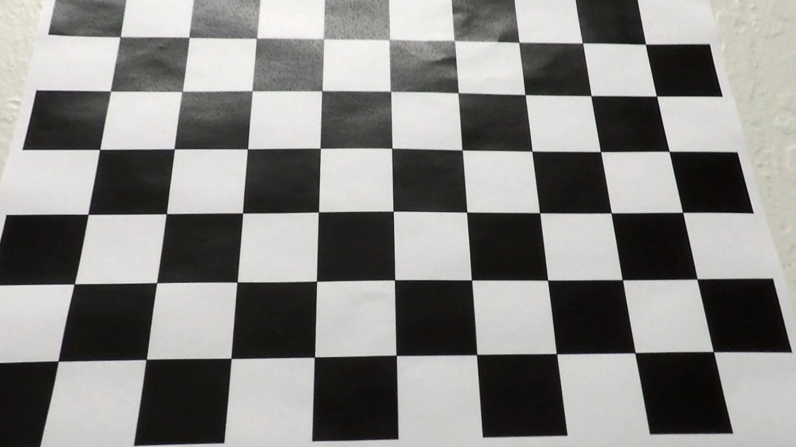
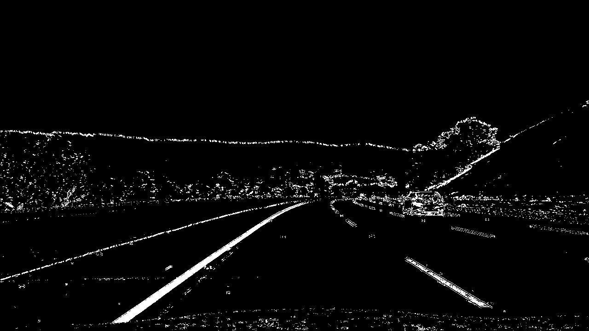
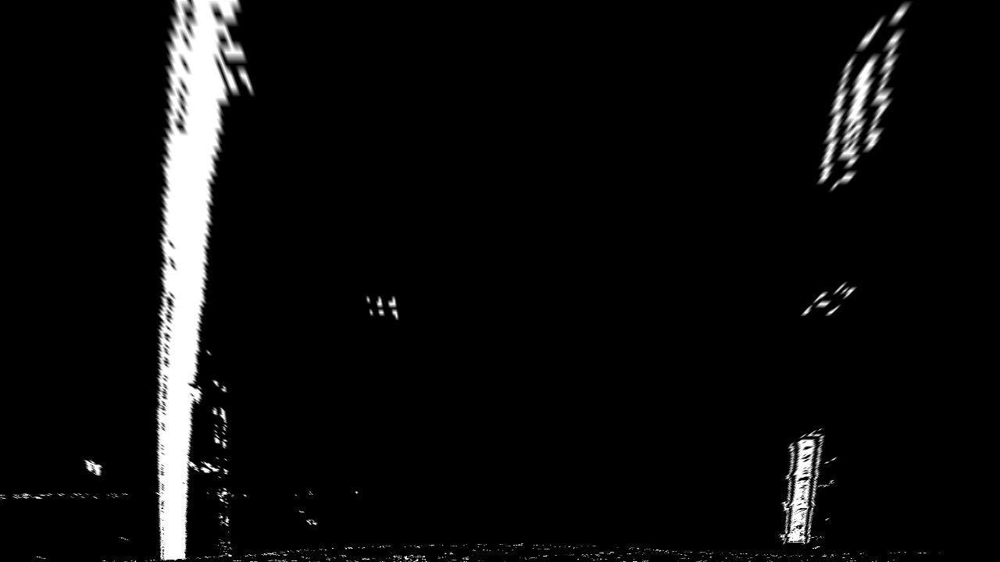
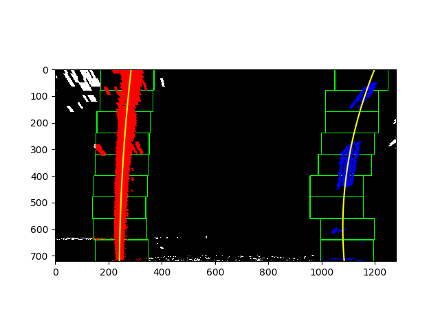
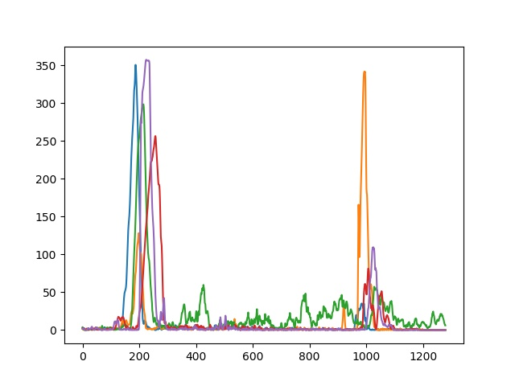
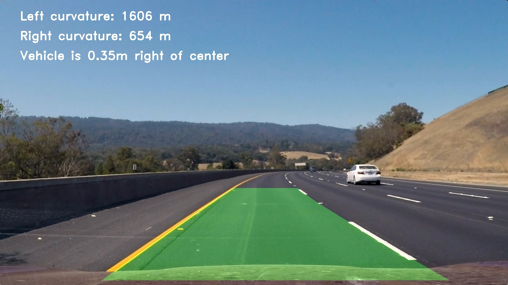

**Advanced Lane Finding Project**

The goals / steps of this project are the following:

* Compute the camera calibration matrix and distortion coefficients given a set of chessboard images.
* Apply a distortion correction to raw images.
* Use color transforms, gradients, etc., to create a thresholded binary image.
* Apply a perspective transform to rectify binary image ("birds-eye view").
* Detect lane pixels and fit to find the lane boundary.
* Determine the curvature of the lane and vehicle position with respect to center.
* Warp the detected lane boundaries back onto the original image.
* Output visual display of the lane boundaries and numerical estimation of lane curvature and vehicle position.

<!-- [//]: # (Image References)

[image1]: ./calibration3.jpg "Undistorted"
[image1]: ./camera_cal/calibration3.jpg "Undistorted"
[image2]: ./output_images/straight_lines1_combined.jpg "Undistorted"
[image2]: ./test_images/test3.jpg "Road Transformed"
[image3]: ./examples/binary_combo_example.jpg "Binary Example"
[image4]: ./examples/warped_straight_lines.jpg "Warp Example"
[image5]: ./examples/color_fit_lines.jpg "Fit Visual"
[image6]: ./examples/example_output.jpg "Output"
[video1]: ./project_video.mp4 "Video" -->

## [Rubric](https://review.udacity.com/#!/rubrics/571/view) Points

### Here I will consider the rubric points individually and describe how I addressed each point in my implementation.  

---

### Writeup / README

####Setup
My project has the following files
1. Pipelines.py - main file to execute the lane finder
2. camera_calibration.py - Has utilities for camera calibration
3. color_transormation.py - Has utilities for color thresholding of the image
4. perspective_transform.py - Has utilities to make bird eye view of the image
5. find_lanes.py - Has utilities to find the lanes using the given image 

### Camera Calibration

The code for this step is contained in "camera_calibration.py".

I have created two functions for the calibrations
1. Find Corners:
I start by preparing "object points", which will be the (x, y, z) coordinates of the chessboard corners in the world. Here I am assuming the chessboard is fixed on the (x, y) plane at z=0, such that the object points are the same for each calibration image.  Thus, `objp` is just a replicated array of coordinates, and `objpoints` will be appended with a copy of it every time I successfully detect all chessboard corners in a test image.  `imgpoints` will be appended with the (x, y) pixel position of each of the corners in the image plane with each successful chessboard detection.  
2. findCalibrationParams():
I then used the output `objpoints` and `imgpoints` to compute the camera calibration and distortion coefficients using the `cv2.calibrateCamera()` function.  I applied this distortion correction to the test image using the `cv2.undistort()` function and obtained this result: 

### Pipeline (single images)

#### 1. Provide an example of a distortion-corrected image.

For the distortion correction I have followed the following steps
1. I used the opencv's undistort function to correct the image. 
2. For this function I took the camera matrix and distortion coefficients from the previous step and applied it on the function to get undistorted image

#### 2. Describe how (and identify where in your code) you used color transforms, gradients or other methods to create a thresholded binary image.  Provide an example of a binary image result.

I used a combination of color, magnitude, direction and gradient thresholds to generate a binary image (thresholding steps at lines 48 through 58 in `pipelines.py`. The utility function definitions are in `color_transformations.py`).  Here's an example of my output for this step.  

#### 3. Describe how (and identify where in your code) you performed a perspective transform and provide an example of a transformed image.

The code for my perspective transform includes a function called `warp_image()`, which appears in lines 6 through 29 in the file `perspective_transform.py`.  The `warp_image()` function takes as inputs an image (`img`), In the function I chose source and destination points by inspecting the image.  I chose the hardcode the source and destination points in the following manner:

This resulted in the following source and destination points:

| Source        | Destination   | 
|:-------------:|:-------------:| 
| 575, 475      |  200, 0        | 
| 725, 475      |  200, 700      |
| 275, 675      | 1000, 0      |
| 1050, 675     | 1000, 700       |

I verified that my perspective transform was working as expected by drawing the `src` and `dst` points onto a test image and its warped counterpart to verify that the lines appear parallel in the warped image.

#### 4. Describe how (and identify where in your code) you identified lane-line pixels and fit their positions with a polynomial?

For finding the lane pixels I created two functions `find_lane_pixels(binary_warped, nwindows=9, margin=100, minpix=50)`  and `searchRemainingPolly(image, left_fit, right_fit, nonzerox, nonzeroy , margin=50)` in file `find_lanes.py`

The first function is to identify the initial x and y fitting in the lane using historgram which is calculated using the warped image from previous step. After this the further points will be identified by using sliding window where we choose a margin and move in y-axis and calculate the mean centre of the pixes. check the below image:

Eventhough this will give the required result it is not efficient to plot a histogram repeatedly and using slide window. So in the next function `searchRemainingPolly()` we take the initial point and the we can search inside a margin

#### 5. Describe how (and identify where in your code) you calculated the radius of curvature of the lane and the position of the vehicle with respect to center.

The curvature and position of vehicle is calculated in the` get_curvature() in find_lanes.py`
For the radius of curvature I used the left and right fit points from the previous step.with the following 

`left_curverad = ((1 + (2*left_fit_cr[0]*y_eval*ym_per_pix + left_fit_cr[1])**2)**1.5) / np.absolute(2*left_fit_cr[0])

right_curverad = ((1 + (2*right_fit_cr[0]*y_eval*ym_per_pix + right_fit_cr[1])**2)**1.5) / np.absolute(2*right_fit_cr[0])`

#### 6. Provide an example image of your result plotted back down onto the road such that the lane area is identified clearly.

I implemented this step in lines function draw_lanes in my code in `find_lanes.py` in the function . 
Once we get the left and right lane points which we calculated using warped image we can plot this lanes on top of the original image. Here is an example of my result on a test image:

---

### Pipeline (video)

#### 1. Provide a link to your final video output.  Your pipeline should perform reasonably well on the entire project video (wobbly lines are ok but no catastrophic failures that would cause the car to drive off the road!).

Here's a [link to my video result](./output_video/project_video.mp4)

---

### Discussion

#### 1. Briefly discuss any problems / issues you faced in your implementation of this project.  Where will your pipeline likely fail?  What could you do to make it more robust?

Currently for the perspective transform I select the image by manually inspecting the test image. This will fail if the road lanes are narrow or has  right angle turning

Also one more issue is with the finding lanes. There might be a chance of stuck with going in wrong lane if the car is initially moving on top of one lane 
